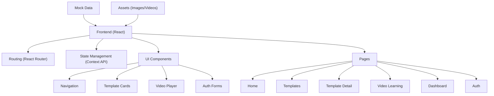
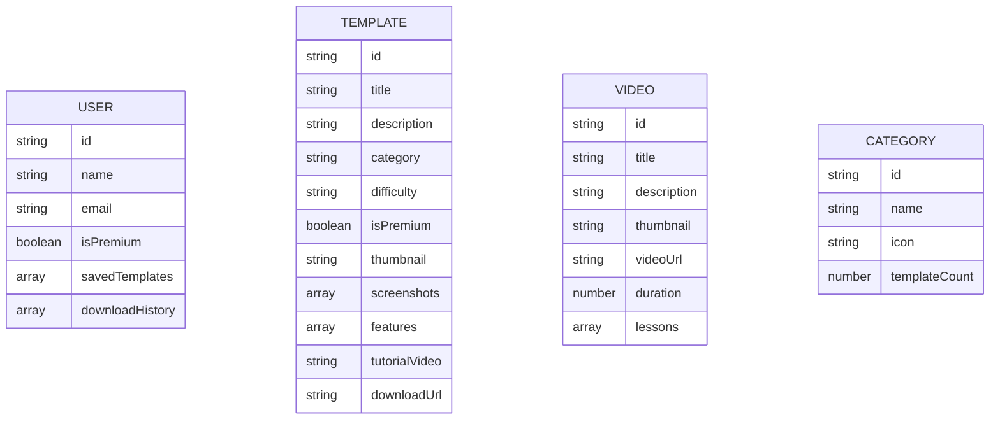

## 1. Architecture Design



## 2. Technology Description

- **Frontend**: React@18 + TypeScript + Tailwind CSS@3 + Vite
- **Initialization Tool**: Vite
- **Backend**: None (mock data for demonstration)
- **Database**: None (local storage and mock data)
- **Routing**: React Router DOM@6
- **Icons**: Lucide React
- **State Management**: React Context API
- **Styling**: Tailwind CSS with custom configuration

## 3. Route Definitions

| Route | Purpose |
|-------|---------|
| / | Home page with hero section, featured templates, categories |
| /templates | Template library with filtering and search |
| /templates/:id | Template detail page with preview and download |
| /videos | Video learning platform with courses |
| /dashboard | User dashboard with history and progress |
| /login | Login page |
| /register | Register page |
| /forgot-password | Forgot password page |

## 4. Data Model

### 4.1 Data Model Definition



### 4.2 Mock Data Structure

```typescript
interface User {
  id: string;
  name: string;
  email: string;
  isPremium: boolean;
  savedTemplates: string[];
  downloadHistory: string[];
}

interface Template {
  id: string;
  title: string;
  description: string;
  category: string;
  difficulty: 'Beginner' | 'Intermediate' | 'Advanced';
  isPremium: boolean;
  thumbnail: string;
  screenshots: string[];
  features: string[];
  tutorialVideo?: string;
  downloadUrl: string;
}

interface Video {
  id: string;
  title: string;
  description: string;
  thumbnail: string;
  videoUrl: string;
  duration: number;
  lessons: Lesson[];
}

interface Lesson {
  id: string;
  title: string;
  duration: number;
  completed: boolean;
}

interface Category {
  id: string;
  name: string;
  icon: string;
  templateCount: number;
}
```

## 5. File Structure

```
nuwana-excel/
├── public/
│   └── assets/
│       ├── images/
│       └── videos/
├── src/
│   ├── components/
│   │   ├── layout/
│   │   │   ├── Navbar.tsx
│   │   │   └── Footer.tsx
│   │   ├── templates/
│   │   │   ├── TemplateCard.tsx
│   │   │   └── TemplateGrid.tsx
│   │   ├── video/
│   │   │   └── VideoPlayer.tsx
│   │   └── ui/
│   │       ├── Button.tsx
│   │       ├── Input.tsx
│   │       └── Card.tsx
│   ├── pages/
│   │   ├── Home.tsx
│   │   ├── Templates.tsx
│   │   ├── TemplateDetail.tsx
│   │   ├── VideoLearning.tsx
│   │   ├── Dashboard.tsx
│   │   ├── Login.tsx
│   │   └── Register.tsx
│   ├── context/
│   │   └── AuthContext.tsx
│   ├── data/
│   │   └── mockData.ts
│   ├── App.tsx
│   ├── main.tsx
│   └── index.css
├── package.json
├── tailwind.config.js
└── vite.config.ts
```

