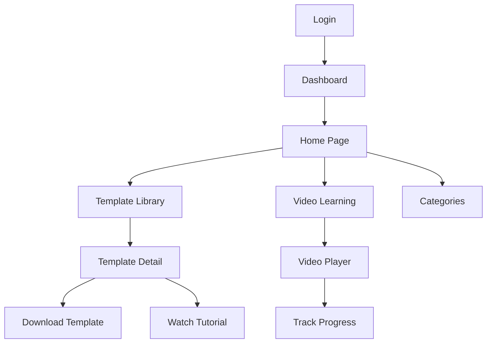

## 1. Product Overview

Nuwana Excel is a modern educational platform dedicated to helping students, professionals, and business owners improve their productivity using Microsoft Excel. The website provides downloadable Excel templates, step-by-step video tutorials, and comprehensive written guides, allowing users to learn while using ready-made templates.

This platform aims to become the go-to hub for Excel learning by combining high-quality templates, structured video tutorials, and detailed written documentation in a single modern, user-friendly platform.

## 2. Core Features

### 2.1 User Roles

| Role | Registration Method | Core Permissions |
|------|---------------------|------------------|
| Normal User | Email registration | Browse templates, watch free videos, download free templates |
| Premium User | Paid subscription | All normal user features + exclusive templates, HD tutorials, advanced features |

### 2.2 Feature Module

1. **Authentication**: Login, register, forgot password, email verification
2. **Home Page**: Hero banner, featured templates, latest templates, categories, featured videos
3. **Template Library**: Browse/search templates, filter by category/difficulty
4. **Template Detail Page**: Preview images, description, features, download, tutorial
5. **Video Learning**: Embedded video player, playlist, progress tracking
6. **Learning Guides**: Written documentation for each template
7. **User Dashboard**: Download history, saved templates, learning progress
8. **Premium System**: Exclusive content for premium users
9. **Navigation & Footer**: Global navigation and footer

### 2.3 Page Details

| Page Name | Module Name | Feature description |
|-----------|-------------|---------------------|
| Login Page | Auth Card | Email/password input, login button, register link, Excel-themed illustration |
| Register Page | Auth Card | Name, email, password, register button, login link |
| Home Page | Hero Banner | Large banner with platform overview and CTA |
| Home Page | Featured Templates | Display of 4-6 featured template cards |
| Home Page | Categories | Grid of template categories with icons |
| Home Page | Featured Videos | Video tutorial thumbnails with play buttons |
| Template Library | Filter Bar | Search, category filter, difficulty filter |
| Template Library | Template Grid | Responsive grid of template cards |
| Template Detail | Preview Section | Large thumbnail and multiple screenshots |
| Template Detail | Info Section | Description, features, benefits, download button |
| Template Detail | Tutorial | Embedded video and written guide |
| Video Learning | Video Player | Large embedded video with controls |
| Video Learning | Playlist | List of lessons with progress indicators |
| User Dashboard | Overview | Download history, saved templates, learning progress |

## 3. Core Process

### User Flow: Browsing and Downloading Templates
1. User arrives at Home Page
2. User browses featured templates or uses search
3. User navigates to Template Detail Page
4. User previews template and reads documentation
5. User downloads template (free or premium)
6. User watches tutorial video if available

### User Flow: Authentication
1. User clicks Login/Register
2. User enters credentials or registers new account
3. User receives verification email (if registering)
4. User is redirected to Dashboard after successful login

## 4. User Interface Design

### 4.1 Design Style
- **Primary Colors**: Green (#21A366 - Excel green), White (#FFFFFF)
- **Secondary Colors**: Dark Gray (#1F2328), Light Gray (#F3F4F6)
- **Button Style**: Rounded corners (8px), soft shadows, hover elevation
- **Fonts**: Poppins for headings, Inter for body text
- **Layout Style**: Card-based, grid layouts, generous whitespace
- **Icon Style**: Modern line icons, Excel-inspired elements

### 4.2 Page Design Overview

| Page Name | Module Name | UI Elements |
|-----------|-------------|-------------|
| Home Page | Hero Section | Full-width banner with gradient green background, large heading, subtext, CTA button, Excel illustration |
| Home Page | Template Cards | Rounded white cards with soft shadows, thumbnail, title, category, difficulty, preview/download buttons |
| Template Detail | Preview | Gallery with main image and thumbnail selector |
| Video Learning | Player | Large video container, playback controls, progress bar |
| Auth Pages | Card | Centered card with glassmorphism effect, illustration on side |

### 4.3 Responsiveness
- Desktop-first design approach
- Fully responsive with breakpoints at 1024px, 768px, 480px
- Mobile-optimized navigation with hamburger menu
- Touch-friendly interactive elements with adequate spacing

